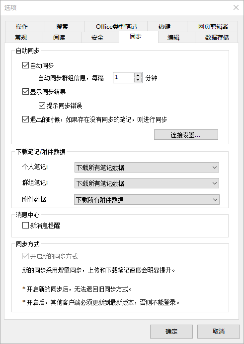
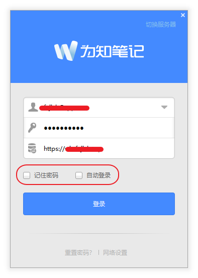
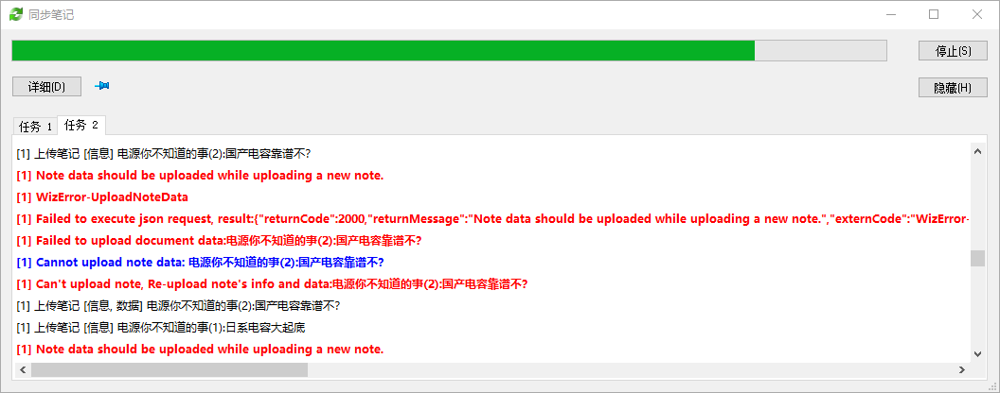

# WizNote-Data-Transfer-Guide
为知笔记迁移数据到自建 Docker 服务器

# 思路

1）客户端下载官服所有笔记，附件等文件到本地
2）修改客户端数据库，上传笔记文件到私服。完成转移


# 前期准备

### 1）同步官服所有数据下来


+ 登录客户端慢慢把全部笔记同步下来
+ 退出，最好打包备份数据
+ 文件夹重命名修改为其他名字备用

### 2）网页登录私服建立与官服一致的
+ 账号跟密码
+ 笔记目录结构

### 3）客户端登录私服，然后退出软件


+ 得到私服的 **index.db** 数据库文件
>注意文件大小为45KB左右
>>同目录下没有 index.db-shm 缓存文件时候才有效
+ 将官服下载来的笔记文件夹移动到私服目录下


# 修改数据库文件

[SQLite官网](https://www.sqlite.org/download.html) 下载 **sqlite-tools-win32-x86-3350400.zip** 
后续要用到压缩包里边的 sqlite3.exe 程序

### 1）导出数据库
`sqlite3 index.db .dump > [官服]dump.sql`
>导出官服数据

`sqlite3 index.db .dump > [私服]dump.sql`
>导出私服数据

### 2）修改数据
NotePad++ 编辑 .sql 文件，把私服 **CREATE TABLE WIZ_META** 开始的内容数据
覆盖到官服数据相应的位置，得到 **[已修改]dump.sql**

### 3）导入数据库
`sqlite3 index.db < [已修改]dump.sql`

### 4）最后修改数据库内的状态值，以触发本地数据上传到服务器
一共需要修改三张数据表
>分别是文档，标签，附件

```
sqlite3 index.db
update WIZ_DOCUMENT set WIZ_VERSION = -1;
update WIZ_TAG set WIZ_VERSION = -1;
update WIZ_DOCUMENT_ATTACHMENT set WIZ_VERSION = -1;
update WIZ_DOCUMENT_ATTACHMENT set WIZ_DOWNLOADED = 1;
.save index.db
.exit
```


# 最后步骤

### 使用客户端登录私服，等待笔记文件上传


笔记完成上传后，删掉客户端数据
重新登录
enjoy ;)
